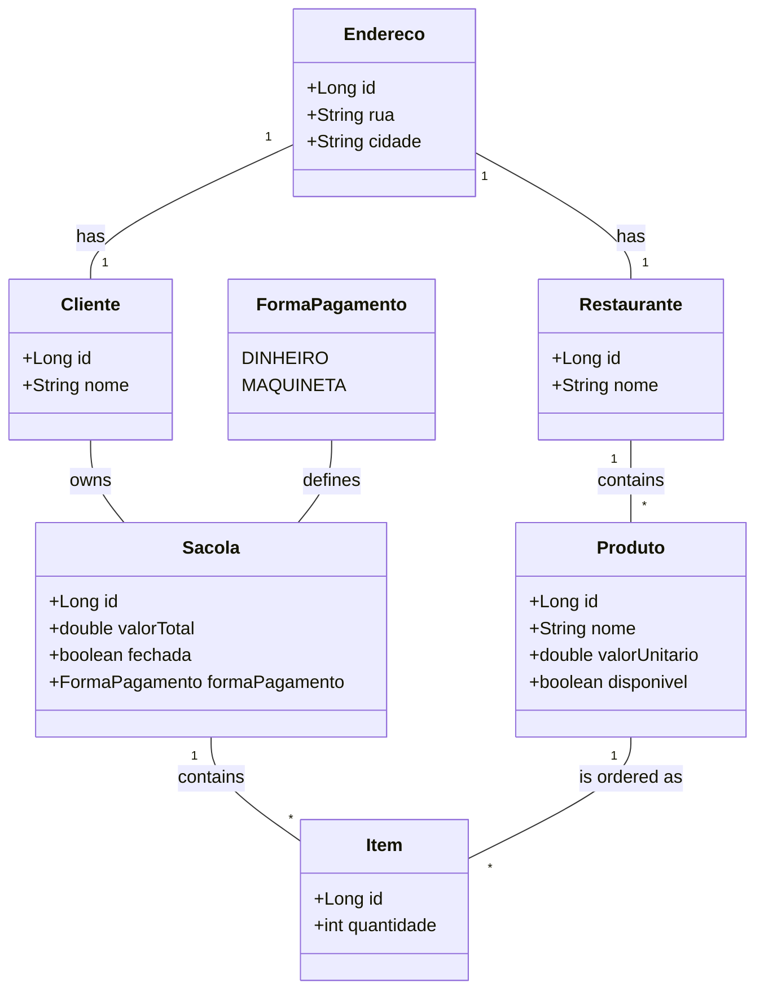

# 🛍️ Sacola API

A RESTful API developed with Spring Boot to manage shopping bags in restaurants.

## 📊 Class Diagram (Mermaid)



## 🚀 Getting Started

### 📋 Prerequisites

- Java 17
- Gradle

### 🔧 Installation

1. Clone the repository:
```bash
git clone https://github.com/barrosohub/sacola-api.git
```

2. Navigate to the project directory and run:
```bash
gradle build
```

3. Start the server:
```bash
gradle bootRun
```

## 🌐 Swagger UI

Explore the API using the Swagger UI interface available at:
```
http://localhost:8080/swagger-ui/index.html
```

## 📦 Project Structure

- **model**: Domain entities - `Endereco`, `Restaurante`, `Produto`, `Cliente`, `Item`, `Sacola`.
- **enumeration**: Different payment methods - `FormaPagamento`.
- **service**: Business logic - `SacolaService` and its implementation `SacolaServiceImpl`.
- **repository**: Data access layer - `ClienteRepository`, `ItemRepository`, `SacolaRepository`, `ProdutoRepository`, `RestauranteRepository`.
- **resource (Controller)**: `SacolaResource` (REST controller) and `ItemDto`.

## 🌐 Endpoints

- Add item to bag: `POST /ifood-devweek/sacolas`
- View bag by ID: `GET /ifood-devweek/sacolas/{id}`
- Close a bag: `PATCH /ifood-devweek/sacolas/fechaSacola/{sacolaId}`

## 📌 Notes

- H2 in-memory database is used. Access H2 console at:
```
http://localhost:8080/h2-console
```
- Ensure you have the Lombok plugin installed in your IDE.

Enjoy 🎉
